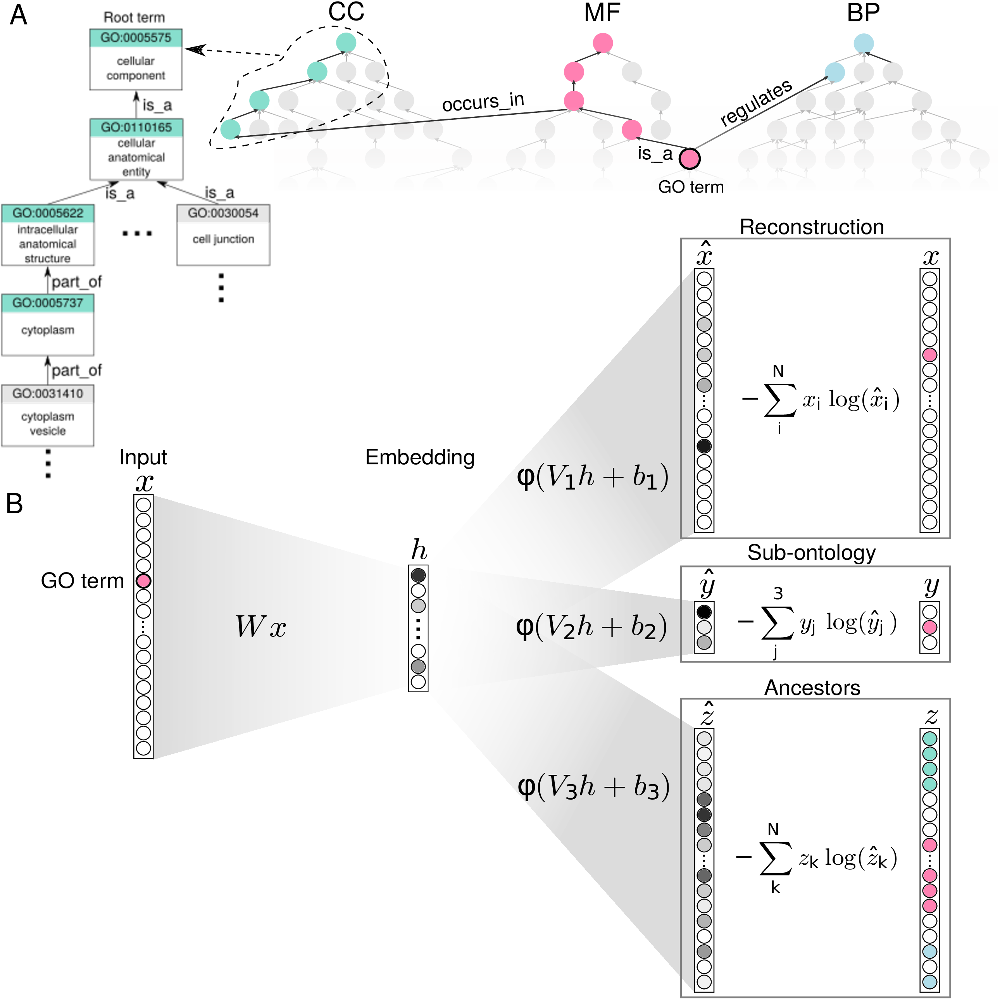

# Anc2Vec

This repository contains the code of Anc2Vec, a method to embed GO terms into
an Euclidean space. Embeddings are constructed to preserve the uniqueness of
terms, their ancestor terms, and sub-ontology information.

Source code and instructions are provided for reproducibility of the main
results of *"Anc2Vec: embedding Gene Ontology terms by preserving ancestors
relationships,"* by A. A. Edera, D. H. Milone, and G. Stegmayer (under
review). Research Institute for Signals, Systems and Computational
Intelligence, [sinc(i)](https://sinc.unl.edu.ar).

<figure  style="float:left">
  

  <figcaption> Fig. 1. The GO and the architecture of Anc2Vec. A) Structure of
  the GO. It is composed of three sub-ontologies: BP, CC, and MF. Colored
  nodes show the ancestors of a sample GO term. B) Anc2Vec architecture. The
  GO term is encoded as a vector x and transformed into a vector h , which is
  mapped into three vectors used to optimize Anc2Vec weights.
  </figcaption>
</figure>

<figure>
  

  <figcaption>Fig. 2. Anc2Vec embeddings of GO terms in the three sub-ontologies. A)
    Points depict embeddings of GO terms. B) Distribution of depths. Colors
    plot the depth of each term in the GO hierarchy. C) The Jaccard index and
    the semantic similarity between the embeddings of GO terms.
.</figcaption>
</figure>
<br>

## Embeddings availability

The pre-trained Anc2Vec embeddings built from the Gene Ontology
([obo file](./anc2vec/data/go.obo) release 2020-10-06) are available
[here](./anc2vec/data/embeddings.pklz). Once downloaded, they can be easily
loaded as follows:

```python
import gzip
import pickle

f = gzip.open('embeddings.pklz', 'rb')
es = pickle.load(f) # read embeddings
f.close()
```

`es` is a python dictionary that maps GO terms with their corresponding
embeddings. For example, to retrieve the embedding of GO:0001780, we can use
the following command:

```python
e = es['GO:0001780']
```

## Examples

Some examples on how to use `anc2vec` package:

* [Use pre-trained embeddings](https://colab.research.google.com/github/aedera/anc2vec/blob/main/examples/pretrained_anc2vec_embeddings.ipynb)
* [Project pre-trained embeddings onto a 2-D space](https://colab.research.google.com/github/aedera/anc2vec/blob/main/examples/project_embeddings.ipynb)
* [Construct embeddings based on a desired obo file](https://colab.research.google.com/github/aedera/anc2vec/blob/main/examples/train_anc2vec_embeddings.ipynb)

## Datasets

Datasets used for experiments:

* [Ancestors dataset](https://drive.google.com/file/d/1fgK50TNg5nrade22SwmqZYOeAxgPHIHY/view?usp=sharing)
* [Protein function dataset](https://drive.google.com/file/d/1eokaKj20tbFTn9jexQXIkONqwHeiBGS-/view?usp=sharing)
* [STRING dataset](https://drive.google.com/file/d/1dBZqQeBuGf35_pGT6qJWSuX1At32t9CI/view?usp=sharing)

## Installation

If you want to construct embeddings using an obo file of your interest, you
can install `anc2vec` package via pip:

```bash
pip install -U "anc2vec @ git+https://github.com/aedera/anc2vec.git"
```
