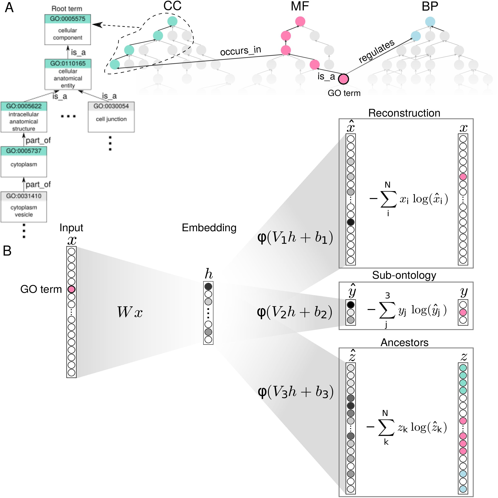

# Anc2vec

Anc2vec is a novel method based on neural networks to construct embeddings of
GO terms. These embeddings can preserve the ontological uniqueness of terms,
their ancestor relationships and sub-ontology information.

This repository is a Python package containing the source code of anc2vec, as
well as instructions for reproducibility of the main results of *"Anc2vec:
embedding Gene Ontology terms by preserving ancestors relationships,"* by
A. A. Edera, D. H. Milone, and G. Stegmayer (under review). Research Institute
for Signals, Systems and Computational Intelligence,
[sinc(i)](https://sinc.unl.edu.ar).

<figure>
  <p align="center">
  
  </p>

  <figcaption> Fig. 1. Schematics of the GO structure and the architecture of
  anc2vec. A) GO structure. It is composed of three sub-ontologies: BP, CC,
  and MF. Colored nodes show the ancestors of a sample GO term. B) Anc2vec
  architecture. The GO term is encoded as a vector x and transformed into a
  vector h , which is mapped into three vectors used to optimize anc2vec
  weights.  </figcaption> </figure>

<figure>
  <p align="center">
  
  </p>

  <figcaption> Fig. 2. Anc2vec embeddings of GO terms in the three
  sub-ontologies. Points depict embeddings of GO terms whose colors encode the
  sub-ontologies: BP (Biological Process), CC (Cellular Component), and MF
  (Molecular Function).
</figcaption> </figure>

## Requirements

Anc2vec requires [Python](https://www.python.org/) 3.6 and
[TensorFlow](https://www.tensorflow.org/) 2.3.1.

## Installation

It is recommendable to have installed
[Conda](https://docs.conda.io/en/latest/), to avoid Python package conflicts.

If Conda is installed, first create and activate a conda environment, for
example, named anc2vec:

```bash conda create --name anc2vec python=3.6 conda activate anc2vec ```
Next, install the `anc2vec` package via the
[pip package manager](https://pip.pypa.io/en/stable/installing/):

```bash
pip install -U "anc2vec @ git+https://github.com/aedera/anc2vec.git"
```

## Anc2vec functionalities

### Access pre-trained embeddings

The `anc2vec` package has already available the same embedding of GO terms
used in the study. These embeddings were built using the Gene Ontology release
[2020-10-06](./anc2vec/data/go.obo). The embeddings can be easily accessed on
Python with this command:

```python
import anc2vec

es = anc2vec.get_embeddings()
```

Here, `es` is a python dictionary that maps GO terms with their corresponding
200-dimensional embeddings. For example, this command uses this dictionary to
retrieve the embedding corresponding to the term `GO:0001780`:

```python
e = es['GO:0001780']
```

The variable `e` is a [Numpy](https://numpy.org/) array containing the
embedding

```python
array([ 0.55203265, -0.23133564,  0.1983797 , -0.3251996 ,  0.20564775,
       -0.32133245, -0.25364587, -0.16675541, -0.46832997, -0.40702957,
       ...
       -0.29757708, -0.33143485, -0.31099185,  0.24465033, -0.25458524,
       -0.24525951, -0.366758  , -0.04628978,  0.29378492,  0.31249675],
      dtype=float32)
```

These `anc2vec` embeddings are ready to be used for semantic similarity
task. Below there are examples showing how to use them for calculating
[cosine distances](https://en.wikipedia.org/wiki/Cosine_similarity).

### Built your own embeddings

The `anc2vec` package also contains a function to build embeddings from
scratch using a specific
[OBO file](http://owlcollab.github.io/oboformat/doc/obo-syntax.html), a
human-readable file usually used to describe the GO. Building embeddings can
be particularly useful for experimental scenarios where a specific version of
the GO is required, such as those available in the
[GO data archive](http://release.geneontology.org/).

The following code shows how to build the embedding for a given OBO file named
`go.obo`.

```python
import anc2vec
import anc2vec.train as builder

es = builder.fit('go.obo', embedding_sz=200, batch_sz=64, num_epochs=100)
```

The object `builder` uses the input `go.obo` file to extract structural
features used to build the embeddings of GO terms. Note that `builder` is
called with additional parameters indicating the dimensionality of the
embeddings (`embedding_sz`) and the number of optimization steps used for
embedding building (`num_epochs`). The embeddings built by `builder` are
stored in `es`, which a Python dictionary mapping GO terms to their
corresponding embeddings.

Please check the examples below for more information about this functionality.


## Notebooks: examples on how to use `anc2vec`

To try anc2vec, below there are links to
[Jupyter notebooks](https://jupyter.org) that use
[Google Colab](https://research.google.com/colaboratory/) which offers free
computing on the Google cloud.

* [Using `anc2vec` pre-trained embeddings](https://colab.research.google.com/github/aedera/anc2vec/blob/main/examples/pretrained_anc2vec_embeddings.ipynb)

* [Projecting `anc2vec` pre-trained embeddings](https://colab.research.google.com/github/aedera/anc2vec/blob/main/examples/project_embeddings.ipynb)

* [Building `anc2vec` embeddings for a desired obo file](https://colab.research.google.com/github/aedera/anc2vec/blob/main/examples/train_anc2vec_embeddings.ipynb)

## Datasets

These are the main datasets used in the experiments of the study:

* [Ancestors dataset](https://drive.google.com/file/d/1fgK50TNg5nrade22SwmqZYOeAxgPHIHY/view?usp=sharing)
* [Protein function dataset](https://drive.google.com/file/d/1eokaKj20tbFTn9jexQXIkONqwHeiBGS-/view?usp=sharing)
* [STRING dataset](https://drive.google.com/file/d/1dBZqQeBuGf35_pGT6qJWSuX1At32t9CI/view?usp=sharing)

## License

The `anc2vec` package is released under the [MIT License](LICENSE).
